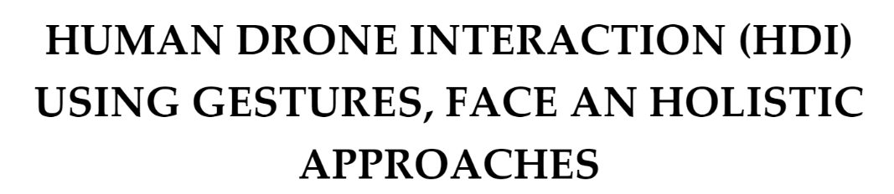

# 2022 HRI Final Project
<!--

    </img>

-->

Final project for the course of Human Robot Interaction 2021/2022.

>Student: Alessandro Lambertini Mat: `1938390`;
>
>Student: Denise Landini Mat: `1938388`;
>
>Student: Gianluca Lofrumento Mat: `1956579`;

## 📝 Assignment

1.	👷 WIP 👷

## 💾 Dataset

-   👷 WIP 👷

## 📜 Report

-   👷 WIP 👷

## 💯 Final score:

Score: `--/30`

## 🙋 Info

for any doubt or clarification contact me on:

-   email at:
    -   lambertini.1938390@studenti.uniroma1.it;
    -   landini.1938388@studenti.uniroma1.it;
    -   lofrumento.1956579@studenti.uniroma1.it.
-   instagram:
    -   [Alessandro Lambertini 🔗](https://www.instagram.com/lambertinialessandro/);
    -   [Denise Landini 🔗](https://www.instagram.com/_officialdeni_/);
    -   [Gianluca Lofrumento 🔗](https://www.instagram.com/gianlucchio/).

## 🎞️ Snapshots
<!--

    </img>
     
    👷 WIP 👷

-->
