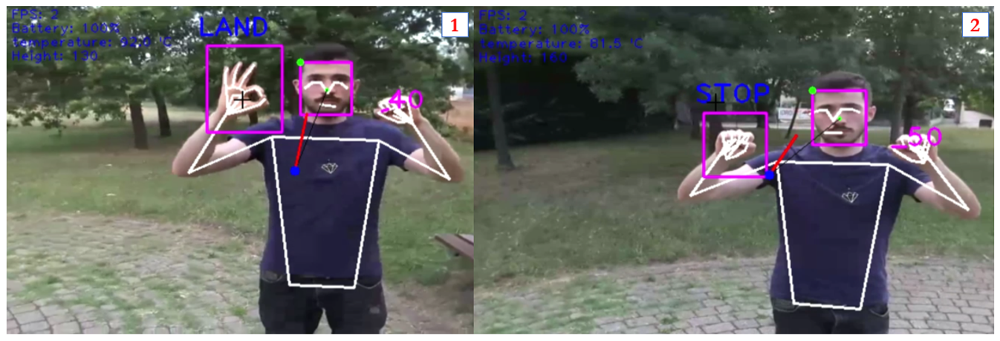

# 2022 HRI Final Project

    </img>

Final project for the course of Human Robot Interaction and Reasoning Agents 2021/2022.

>Student: Alessandro Lambertini Mat: `1938390`;
>
>Student: Denise Landini Mat: `1938388`;
>
>Student: Gianluca Lofrumento Mat: `1956579`;

## 📝 Assignment

-   **HRI**:
    1.	👷 WIP 👷
    2.	👷 WIP 👷

-   **RA**:
    1.	👷 WIP 👷
    2.	👷 WIP 👷

## 📜 Report

-   report [Link 🔗](./HRI-RA%20FinalProject%20report.pdf)

    In this file you can read more about the project.

## 💯 Final score:

Score: `--/30`

## 🙋 Info

for any doubt or clarification contact me on:

-   email at:
    -   lambertini.1938390@studenti.uniroma1.it;
    -   landini.1938388@studenti.uniroma1.it;
    -   lofrumento.1956579@studenti.uniroma1.it.
-   instagram:
    -   [Alessandro Lambertini 🔗](https://www.instagram.com/lambertinialessandro/);
    -   [Denise Landini 🔗](https://www.instagram.com/_officialdeni_/);
    -   [Gianluca Lofrumento 🔗](https://www.instagram.com/gianlucchio/).

## 🎞️ Snapshots

 <b>---------- Link Video Youtube ----------</b>

    [Link Video Youtube 🔗](👷 WIP 👷).

 <b>---------- Code Structure ----------</b>

    </img>
     
    Project Pipeline

    </img>
     
    Project Class Diagram

 <b>---------- Hand and Body Landmarks ----------</b>

    </img>
     
    Hand landmarks

    </img>
     
    Hand gestures command seen by the drone’s camera

    </img>
     
    BlazePose landmarks

 <b>---------- Reasoning Agent Finite State Machine ----------</b>

    </img>
     
    FSM RA face

    </img>
     
    FSM RA Holistic

    </img>
     
    Idea FSM RA Holistic

 <b>---------- Tests ----------</b>

    </img>
     
    This represents the forward and stop actions performed by the drone

    </img>
     
    The first image represents the starting position and after some side movements of the user,
    the drone always rotate to follow the face until the user stops

    </img>
     
    The first image represents the holistic approach considering the land action; 
    the image 2 represents the holistic approach considering the stop action.

